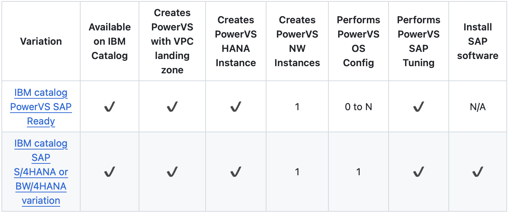

---

copyright:
  years: 2023, 2025
lastupdated: "2025-10-30"
subcollection: sap-powervs
keywords: powervs, landing zone, sap, automation, deployable architecture, hana, s4hana, bw4hana

---

{{site.data.keyword.attribute-definition-list}}

# Overview of {{site.data.keyword.powerSys_notm}} for SAP HANA deployable architecture
{: #automation-solution-overview}

This automated deployable architecture guide is an fullstack to the main [IBM Cloud for SAP portfolio documentation](https://cloud.ibm.com/docs/sap), focusing on the automated reference architecture and steps required for the automated deployment.
{: shortdesc}

SAP solution provisioning on {{site.data.keyword.powerSys_notm}} using deployable architectures provides an automated deployment method to create a {{site.data.keyword.powerSys_notm}} landscape with SAP HANA systems. Comparing the provisioning via webUI, user interaction is minimized and SAP system deployment time is reduced from weeks to days.

Automated SAP provisioning on {{site.data.keyword.powerSys_notm}} described in this guide is based upon IBM Catalog deployable architectures. In this documentation we describe only specifics related to SAP HANA solution provisioning using deployable architectures.

## SAP on Power related deployable architectures
{: #automation-solution-components}

SAP solution provisioning as deployable architectures is delivered as a single Terraform-based solution that integrates {{site.data.keyword.powerSysFull}} and SAP HANA deployment in an automated way.

In the following sections, the deployable architecture variants are described.

{: caption="Solution Overview" caption-side="center"}

## 1. Variation - SAP ready PowerVS
{: #overview-sap-ready-powervs}

'SAP ready PowerVS' variation of '{{site.data.keyword.powerSysFull}} for SAP HANA' creates a basic and expandable SAP system landscape that integrates the [{{site.data.keyword.powerSysFull}} with VPC landing zone](/catalog/architecture/deploy-arch-ibm-pvs-inf-2dd486c7-b317-4aaa-907b-42671485ad96-global) as part of a unified deployable architecture. {{site.data.keyword.powerSys_notm}} instances for SAP HANA and SAP NetWeaver are deployed and preconfigured for SAP installation.

Services such as DNS, NTP and NFS running in VPC and provided by '{{site.data.keyword.powerSysFull}} with VPC landing zone' are leveraged.
Transit gateway provide the network bridge between the IBM Power infrastructure and the IBM VPC and public internet.
The resulting SAP landscape leverages the services such as Activity Tracker, Cloud Object Storage, Key Management and the network connectivity configuration provided by '{{site.data.keyword.powerSysFull}} with VPC landing zone'.

This deployable architecture variation deploys these resources:

| Resource Type                                                                 | Optional | Description                                                                                                                                                                                                                                                                              |
|-------------------------------------------------------------------------------|----------|------------------------------------------------------------------------------------------------------------------------------------------------------------------------------------------------------------------------------------------------------------------------------------------|
| Workspace for {{site.data.keyword.powerSys_notm}}                             |          | [Workspace for {{site.data.keyword.powerSys_notm}}](/docs/power-iaas?topic=power-iaas-creating-power-virtual-server#creating-service) with 1 subnet and an SSH key                                                                                                                       |
| {{site.data.keyword.powerSys_notm}} Images                                    | Yes      | Imports up to two custom images from Cloud Object Storage into Workspace for {{site.data.keyword.powerSys_notm}}. Optionally let's the user choose a byol or custom os image for the HANA and Netweaver PowerVS instances and activate it with user provided os registration credentials.|
| {{site.data.keyword.powerSys_notm}} Instance for SAP HANA                     |          | Creates and configures one {{site.data.keyword.powerSys_notm}} instance using [certified profiles](/docs/sap?topic=sap-hana-iaas-offerings-profiles-power-vs) for SAP HANA based on best practices                                                                                       |
| {{site.data.keyword.powerSys_notm}} Instance for SAP Application or NetWeaver | Yes      | Creates and configures multiple {{site.data.keyword.powerSys_notm}} instances for SAP NetWeaver based on best practices                                                                                                                                                                  |
| {{site.data.keyword.powerSys_notm}} Volumes                                   |          | Filesystem sizes for HANA data and HANA log are calculated automatically based on the memory size. Custom storage configuration by providing custom volume size, iops(tier0, tier1, tier3, tier5k), counts and mount points is supported.                                                |
{: class="sap-ready-powervs-table"}
{: tab-group="sap-ready-powervs"}
{: #sap-ready-powervs-1}
{: tab-title="{{site.data.keyword.powerSys_notm}}"}
{: caption="SAP Ready to go components" caption-side="bottom"}

| Resource Type                               | Optional | Description                                                                                                                                                                                                                                                                                                                         |
|---------------------------------------------|----------|-------------------------------------------------------------------------------------------------------------------------------------------------------------------------------------------------------------------------------------------------------------------------------------------------------------------------------------|
|  VPC                                        |          | Edge VPC: ACL, SGs, SSH Key and 4 Subnets                                                                                                                                                                                                                                                                                           |
|  Intel VSI                                  |          | Jump box with 2 cores, 4GB memory running RHEL 9.6 with floating IP attached                                                                                                                                                                                                                                                        |
|  Intel VSI                                  |          | Network Services running RHEL 9.6 configured as squid proxy, NTP and DNS servers(using Ansible Galaxy collection roles [IBM Power Linux for SAP](https://galaxy.ansible.com/ui/repo/published/ibm/power_linux_sap/)). Also configured as central ansible execution node. Default size is 2 cores and 4 GB memory. Can be customized.|
| Intel VSI,\nIBM Cloud Monitoring Instance   | Yes      | Monitoring Host running SLES 15SP6 to collect metrics and forward it to IBM Monitoring Instance\n [IBM Cloud monitoring Instance](/docs/monitoring) displays the platform metrics and OS metrics                                                                                                                                    |
| File storage share,\n Network load balancer | Yes      | [NFS as a Service](/docs/vpc?topic=vpc-file-storage-create&interface=ui)\n [Network Load Balancer](/docs/vpc?group=network-load-balancer) is deployed along with File storage share to access the share IP from Power Virtual Server                                                                                                |
| Virtual Private Endpoint Gateway            |          | A [Virtual Private Endpoint Gateway](/docs/vpc?topic=vpc-about-vpe) to reach the Cloud Object Storage bucket                                                                                                                                                                                                                        |
| Flow Logs for VPC                           |          | [Flow Logs for VPC](/docs/vpc?topic=vpc-flow-logs) enables the collection, storage, and presentation of information about the Internet Protocol (IP) traffic going to and from network interfaces within your VPC                                                                                                                   |
| Client to site VPN Server,\nSecrets Manager | Yes      | [Client to site VPN Server](/docs/vpc?topic=vpc-vpn-client-to-site-overview) provides client-to-site connectivity, which allows remote devices to securely connect to the VPC network using an OpenVPN software client.\n [Secrets Manager](/docs/secrets-manager) Instance is deployed along with VPN to store the VPN Certificate |
{: class="sap-ready-powervs-table"}
{: tab-group="sap-ready-powervs"}
{: #sap-ready-powervs-2}
{: tab-title="VPC"}
{: caption="SAP Ready to go components" caption-side="bottom"}

| Resource Type                                | Optional | Description |
|----------------------------------------------|----------|------------------------------------------------------------------------------------------------------------------------------------------------------------------------------------------------------------------------------------------------------------------------------------------------------------------------------------------------------------|
| Key Protect                                  |          | [Key Protect](/docs/key-protect) provides key management by integrating the IBM Key Protect for IBM Cloud service. These key management services help you create, manage, and use encryption keys to protect your sensitive data                                                                                                                           |
| Transit Gateway                              |          | Global or local [Transit Gateway](/docs/transit-gateway) to interconnect VPC and {{site.data.keyword.powerSys_notm}} workspace                                                                                                                                                                                                                             |
| Cloud Object Storage                         |          |  [Cloud Object Storage](/docs/cloud-object-storage) instance, buckets and credentials are created                                                                                                                                                                                                                                                          |
| {{site.data.keyword.monitoringfull_notm}}    | Yes      | [{{site.data.keyword.monitoringshort}}](/docs/monitoring?topic=monitoring-about-monitor) collects metrics to provide a web UI to monitor the performance and overall system health of the deployment. Interconnects with {{site.data.keyword.sysdigsecure_full_notm}} if used.                                                                             |
| {{site.data.keyword.sysdigsecure_full_notm}} | Yes      | [{{site.data.keyword.sysdigsecure_short}}](/docs/workload-protection?topic=workload-protection-key-features#feature_1) can be used to find and prioritize software vulnerabilities, detect and respond to threats, manage configurations, permissions, and compliance from source to run. Interconnects with {{site.data.keyword.monitoringshort}} if used.|
{: class="sap-ready-powervs-table"}
{: tab-group="sap-ready-powervs"}
{: #sap-ready-powervs-3}
{: tab-title="Cloud Service"}
{: caption="SAP Ready to go components" caption-side="bottom"}

### Notes
{: #overview-sap-ready-powervs-notes}

-  **Does not install any SAP software or solutions.**
-  **Do not specify** a filesystem `/sapmnt` explicitly for NetWeaver instance, as a 300GB volume is automatically created on the primary NetWeaver instance.

## 2. Variation - SAP S/4HANA or BW/4HANA
{: #overview-sap-s4hana-bw4hana}

SAP S/4HANA or BW/4HANA' variation of '{{site.data.keyword.powerSysFull}} for SAP HANA' creates a basic and expandable SAP system landscape that integrates the [{{site.data.keyword.powerSysFull}} with VPC landing zone](/catalog/architecture/deploy-arch-ibm-pvs-inf-2dd486c7-b317-4aaa-907b-42671485ad96-global) as part of a unified deployable architecture. PowerVS instances for SAP HANA, SAP NetWeaver and optionally for shared SAP files are deployed and preconfigured for SAP installation.

**S/4HANA or BW/4HANA solution is installed based on selected version.**
- Supports installation of **S/4HANA2023, S/4HANA2022, S/4HANA2021, S/4HANA2020, BW/4HANA2021**.
- Supports installation using **Maintenance Planner** as well.

Services such as DNS, NTP and NFS running in VPC and provided by '{{site.data.keyword.powerSysFull}} with VPC landing zone' are leveraged.

Transit gateway provide the network bridge between the IBM Power infrastructure and the IBM VPC and public internet.
The resulting SAP landscape leverages the services such as Activity Tracker, Cloud Object Storage, Key Management and the network connectivity configuration provided by '{{site.data.keyword.powerSysFull}} with VPC landing zone'.

This deployable architecture variation deploys these resources:

| Resource Type                                                                 | Optional | Description                                                                                                                                                                                                                                                                              |
|-------------------------------------------------------------------------------|----------|------------------------------------------------------------------------------------------------------------------------------------------------------------------------------------------------------------------------------------------------------------------------------------------|
| Workspace for {{site.data.keyword.powerSys_notm}}                             |          | [Workspace for {{site.data.keyword.powerSys_notm}}](/docs/power-iaas?topic=power-iaas-creating-power-virtual-server#creating-service) with 1 subnet and an SSH key                                                                                                                       |
| {{site.data.keyword.powerSys_notm}} Images                                    | Yes      | Imports up to two custom images from Cloud Object Storage into Workspace for {{site.data.keyword.powerSys_notm}}. Optionally let's the user choose a byol or custom os image for the HANA and Netweaver PowerVS instances and activate it with user provided os registration credentials.|
| {{site.data.keyword.powerSys_notm}} Instance for SAP HANA                     |          | Creates and configures one {{site.data.keyword.powerSys_notm}} instance using [certified profiles](/docs/sap?topic=sap-hana-iaas-offerings-profiles-power-vs) based on best practices for HANA database.                                                                                 |
| {{site.data.keyword.powerSys_notm}} Instance for SAP Application or NetWeaver |          | Creates and configures one {{site.data.keyword.powerSys_notm}} instances for SAP NetWeaver based on best practices, hosting the PAS and ASCS instances.                                                                                                                                  |
| {{site.data.keyword.powerSys_notm}} Volumes                                   |          | Filesystem sizes for HANA data and HANA log are calculated automatically based on the memory size. Custom storage configuration by providing custom volume size, iops(tier0, tier1, tier3, tier5k), counts and mount points is supported.                                                |
{: class="sap-s4hana-bw4hana-table"}
{: tab-group="sap-s4hana-bw4hana"}
{: #sap-s4hana-bw4hana-1}
{: tab-title="{{site.data.keyword.powerSys_notm}}"}
{: caption="SAP S4HANA or BW4HANA components" caption-side="bottom"}

| Resource Type                               | Optional | Description                                                                                                                                                                                                                                                                                                                         |
|---------------------------------------------|----------|-------------------------------------------------------------------------------------------------------------------------------------------------------------------------------------------------------------------------------------------------------------------------------------------------------------------------------------|
|  VPC                                        |          | Edge VPC: ACL, SGs, SSH Key and 4 Subnets                                                                                                                                                                                                                                                                                           |
|  Intel VSI                                  |          | Jump box with 2 cores, 4GB memory running RHEL 9.6 with floating IP attached                                                                                                                                                                                                                                                        |
|  Intel VSI                                  |          | Network Services running RHEL 9.6 configured as squid proxy, NTP and DNS servers(using Ansible Galaxy collection roles [IBM Power Linux for SAP](https://galaxy.ansible.com/ui/repo/published/ibm/power_linux_sap/)). Also configured as central ansible execution node. Default size is 2 cores and 4 GB memory. Can be customized.|
| Intel VSI,\nIBM Cloud Monitoring Instance   | Yes      | Monitoring Host running SLES 15SP6 to collect metrics and forward it to IBM Monitoring Instance\n [IBM Cloud monitoring Instance](/docs/monitoring) displays the platform metrics and OS metrics                                                                                                                                    |
| File storage share,\n Network load balancer | Yes      | [NFS as a Service](/docs/vpc?topic=vpc-file-storage-create&interface=ui)\n [Network Load Balancer](/docs/vpc?group=network-load-balancer) is deployed along with File storage share to access the share IP from Power Virtual Server                                                                                                |
| Virtual Private Endpoint Gateway            |          | A [Virtual Private Endpoint Gateway](/docs/vpc?topic=vpc-about-vpe) to reach the Cloud Object Storage bucket                                                                                                                                                                                                                        |
| Flow Logs for VPC                           |          | [Flow Logs for VPC](/docs/vpc?topic=vpc-flow-logs) enables the collection, storage, and presentation of information about the Internet Protocol (IP) traffic going to and from network interfaces within your VPC                                                                                                                   |
| Client to site VPN Server,\nSecrets Manager | Yes      | [Client to site VPN Server](/docs/vpc?topic=vpc-vpn-client-to-site-overview) provides client-to-site connectivity, which allows remote devices to securely connect to the VPC network using an OpenVPN software client.\n [Secrets Manager](/docs/secrets-manager) Instance is deployed along with VPN to store the VPN Certificate |
{: class="sap-s4hana-bw4hana-table"}
{: tab-group="sap-s4hana-bw4hana"}
{: #sap-s4hana-bw4hana-2}
{: tab-title="VPC"}
{: caption="SAP S4HANA or BW4HANA components" caption-side="bottom"}

| Resource Type                                | Optional | Description |
|----------------------------------------------|----------|------------------------------------------------------------------------------------------------------------------------------------------------------------------------------------------------------------------------------------------------------------------------------------------------------------------------------------------------------------|
| Key Protect                                  |          | [Key Protect](/docs/key-protect) provides key management by integrating the IBM Key Protect for IBM Cloud service. These key management services help you create, manage, and use encryption keys to protect your sensitive data                                                                                                                           |
| Transit Gateway                              |          | Global or local [Transit Gateway](/docs/transit-gateway) to interconnect VPC and {{site.data.keyword.powerSys_notm}} workspace                                                                                                                                                                                                                             |
| Cloud Object Storage                         |          |  [Cloud Object Storage](/docs/cloud-object-storage) instance, buckets and credentials are created                                                                                                                                                                                                                                                          |
| {{site.data.keyword.monitoringfull_notm}}    | Yes      | [{{site.data.keyword.monitoringshort}}](/docs/monitoring?topic=monitoring-about-monitor) collects metrics to provide a web UI to monitor the performance and overall system health of the deployment. Interconnects with {{site.data.keyword.sysdigsecure_full_notm}} if used.                                                                             |
| {{site.data.keyword.sysdigsecure_full_notm}} | Yes      | [{{site.data.keyword.sysdigsecure_short}}](/docs/workload-protection?topic=workload-protection-key-features#feature_1) can be used to find and prioritize software vulnerabilities, detect and respond to threats, manage configurations, permissions, and compliance from source to run. Interconnects with {{site.data.keyword.monitoringshort}} if used.|
{: class="sap-s4hana-bw4hana-table"}
{: tab-group="sap-s4hana-bw4hana"}
{: #sap-s4hana-bw4hana-3}
{: tab-title="Cloud Service"}
{: caption="SAP S4HANA or BW4HANA components" caption-side="bottom"}

### Notes
{: #overview-sap-s4hana-bw4hana-notes}

- **Do not specify** a filesystem `/sapmnt` explicitly for NetWeaver instance, as a 300GB volume is automatically created on the primary NetWeaver instance.
