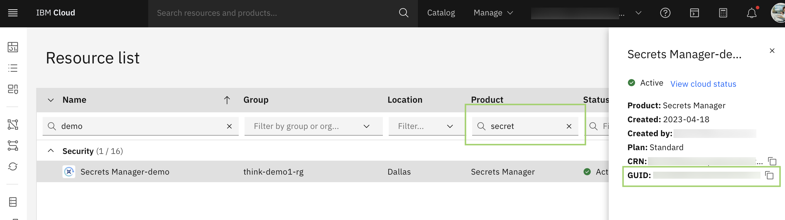

---

copyright:
  years: 2023, 2025
lastupdated: "2025-10-30"
subcollection: sap-powervs
keywords: iam, permissions, plan, ssh key
content-type: tutorial
services: iam, apikey, sshkeys, DA
completion-time: 1h

---

{{site.data.keyword.attribute-definition-list}}

# Before you begin deploying
{: #powervs-automation-prereqs}
{: toc-content-type="tutorial"}
{: toc-services="iam, apikey, sshkeys, DA"}
{: toc-completion-time="1h"}


This tutorial walks through necessary steps required to be preformed which enables a user to successfully deploy the architecture.

## IAM Permissions
{: #solution-iam-permissions}
{: step}

IAM access roles are required to install this deployable architecture and create all the required elements.

You need the following permissions for this deployable architecture:

1. Create services from {{site.data.keyword.cloud_notm}} catalog.
1. Create and modify {{site.data.keyword.vpc_short}} services, virtual server instances, networks, network prefixes, storage volumes, SSH keys, and security groups of this VPC.
1. Create and modify {{site.data.keyword.powerSysShort}} services, virtual server instances, networks, storage volumes, ssh keys of this {{site.data.keyword.powerSysShort}}.
1. Create and modify {{site.data.keyword.cloud_notm}} direct links and {{site.data.keyword.tg_full_notm}}.
1. Access existing {{site.data.keyword.cos_short}} services.
1. The Editor role on the Projects service.
1. The Editor and Manager role on the Schematics service.
1. The Viewer role on the resource group for the project.

For information about configuring permissions, contact your {{site.data.keyword.cloud_notm}} account administrator.

## Generate API key
{: #solution-generate-api-key}
{: step}

The API key is **mandatory** for the deployment. The API keys can be deleted independently if compromised without interfering with other API keys or even the user. You can create up to 20 API keys.

To create an API key for your user identity in the UI, complete the following steps:
1. In the IBM Cloud console, go to **Manage > Access (IAM) > API keys**.
1. Click Create an **IBM Cloud API key**.
1. Enter a name and description for your API key.
1. Click **Create**.
1. Then, click Show to display the API key. Or, click Copy to copy and save it for later, or click Download.

## Generate a SSH key Pair
{: #solution-ssh-key}
{: step}

This key is used to log in to all virtual server instances that you create.

**This step can be skipped** if user has already a pair of ssh keys which meet the following requirements:
1. Key is of **RSA** format
1. **No passphrase** (must not be password encrypted)
1. SSH public key is **currently unused** in the target deployment region.

**Paste the content of** `id_rsa.pub` **key and** `id_rsa` **key directly in the field for input variables** `ssh_public_key` and `ssh_private_key` **respectively.**

If **you do not have existing keys**, steps to generate keys is defined below.

SSH Key can be generated by using any method. When generating a key pair, make sure that:
1. **passphrase is empty (must not be password encrypted)**
1. Key format is `RSA`.

### Linux OS
{: #solution-ssh-key-linux}

On the command line type, the command `ssh-keygen`. It places the id_rsa and id_rsa.pub files under `/root/.ssh/id_rsa`.

```sh
ssh-keygen -t rsa
Generating public/private rsa key pair.
Enter file in which to save the key (/root/.ssh/id_rsa):
Enter passphrase (empty for no passphrase):
Enter same passphrase again:
Your identification has been saved in /root/.ssh/id_rsa
Your public key has been saved in /root/.ssh/id_rsa.pub
The key fingerprint is:
SHA256:TUdZn9O6tnwK2lc4m917Cs1KvbyXs2n46yrlE2I1t/I root@ans-jump-box-001
The key's randomart image is:
+---[RSA 3072]----+
|            .o.  |
|           ..  .o|
|          . .  oo|
|         o . o o.|
|        S . . +..|
|           o Boo.|
|          . B @*o|
|           = @+EB|
|          . +o#&*|
+----[SHA256]-----+
```
{: pre}

### Windows OS
{: #solution-ssh-key-windows}

You can install [MobaXterm](https://mobaxterm.mobatek.net/download.html){: external} application and start a local terminal.
On the command line type, the command `ssh-keygen`. It places the id_rsa and id_rsa.pub files under `/home/mobaxterm/.ssh/`

```sh
ssh-keygen -t rsa
Generating public/private rsa key pair.
Enter file in which to save the key (/home/mobaxterm/.ssh/id_rsa):
Enter passphrase (empty for no passphrase):
Enter same passphrase again:
Your identification has been saved in /home/mobaxterm/.ssh/id_rsa
Your public key has been saved in /home/mobaxterm/.ssh/id_rsa.pub
The key fingerprint is:
SHA256:TUdZn9O6tnwK2lc4m917Cs1KvbyXs2n46yrlE2I1t/I
The key's randomart image is:
+---[RSA 3072]----+
|            .o.  |
|           ..  .o|
|          . .  oo|
|         o . o o.|
|        S . . +..|
|           o Boo.|
|          . B @*o|
|           = @+EB|
|          . +o#&*|
+----[SHA256]-----+
```
{: pre}

**These public and private key values** can now be used in the input variables for the Deployable architectures.

**Paste the content of `id_rsa.pub` key and `id_rsa` key directly in the field for input variables `ssh_public_key` and `ssh_private_key`respectively.**


## Reusing existing Secrets Manager Instance (Optional)
{: #solution-vpn-prereqs}
{: step}

The Deployable architecture supports creation of Client to site VPN server optionally. If enabled, the prerequisite for creating a Client to site VPN server is a Server Certificate which can be only read from a {{site.data.keyword.secrets-manager_short}} instance.

The automation provides flexibility in:
- Automatically generating a new VPN server Certificate, creating a new {{site.data.keyword.secrets-manager_short}} instance and storing the certificate.
- Allowing the user to pass the details of existing {{site.data.keyword.secrets-manager_short}} instance in the optional parameters field which would override the default configuration of creating a new {{site.data.keyword.secrets-manager_short}} instance.

- To **reuse** the {{site.data.keyword.secrets-manager_short}} instance if you have one, you need the following information:

    The Terraform module creates a {{site.data.keyword.secrets-manager_short}} instance if you don't already have one.
    {: reminder}

    - Copy the `region` of your {{site.data.keyword.secrets-manager_short}} instance by using the {{site.data.keyword.cloud_notm}} console.
    - Copy the `GUID` of the instance. You can locate the {{site.data.keyword.secrets-manager_short}} GUID in your account from the resource list in the {{site.data.keyword.cloud_notm}} console as shown in the following screenshot.
        1.  Enter `secret` in the product filter. A list of {{site.data.keyword.secrets-manager_short}} instances are displayed.
        1.  Click the row to display the details in the sidebar for the {{site.data.keyword.secrets-manager_short}} instance that you want to use.
        1.  Copy the GUID.

            {: caption="Example view of the resource list with Secrets Manager in {{site.data.keyword.cloud_notm}} console" caption-side="bottom"}


## Determine size parameters
{: #solution-size-parameters}
{: step}

Determine the size parameters for each SAP workload that you plan to deploy. The most important parameters are memory size (especially for SAP HANA) and the number of SAPs. Most of the other configurations can be derived from these two key metrics.

For more information, see [Sizing process for SAP Systems](/docs/sap?topic=sap-sizing) and see [SAP Sizing](https://www.sap.com/about/benchmark/sizing.html).

For deployment of each SAP system, you must be aware about how many SAP NetWeaver instances you plan to deploy.

For deployment of each SAP NetWeaver PowerVS instance, you must be aware of the following sizing parameters:

- Memory size
- Number of CPUs

For deployment of SAP HANA PowerVS instance, you must be aware of the following sizing parameters:

- SAP t-shirt size as combination of memory and number of CPUs. Check for certified profiles [here](https://cloud.ibm.com/docs/sap?topic=sap-hana-iaas-offerings-profiles-power-vs)

## SAP software installation packages for the SAP S/4HANA or BW/4HANA variation only
{: #solution-sap-install-packages}
{: step}

You must have an existing IBM Cloud Object Storage instance.
{: important}

These steps apply to the SAP S/4HANA or BW/4HANA variation only.

1. Within the instance, an {{site.data.keyword.cos_short}} bucket that contains the SAP Software installation media files is required.
1. To configure access to these software packages from a running virtual server instance, you need the following information:
    - {{site.data.keyword.cos_short}} endpoint
    - {{site.data.keyword.cos_short}} bucket name
    - {{site.data.keyword.cos_short}} HMAC access key
    - {{site.data.keyword.cos_short}} HMAC secret access key

Follow the [tutorial here](/docs/sap-powervs?topic=sap-powervs-solution-create-cos-instance) which details the steps to create a Cloud Object Storage (COS) instance and organizing the SAP binaries in correct structure.

## Learn about deployment input parameters
{: #solution-input-parameters}
{: step}

Ensure that you are familiar with the required input for the deployment execution. See [description for input parameters](https://github.com/terraform-ibm-modules/terraform-ibm-powervs-sap/blob/main/solutions/ibm-catalog/sap-ready-to-go/README.md){: external}.

## Additional background information
{: #solution-prereqs-additional}

- [IBM {{site.data.keyword.powerSysFull}} s service documentation](/docs/power-iaas)
- [SAP on IBM Cloud documentation](/docs/sap)
- [Deployable architecture code](https://github.com/terraform-ibm-modules/terraform-ibm-powervs-sap){: external}
- Main dependencies:
    - [Terraform IBM Module - PowerVS Infrastructure](https://github.com/terraform-ibm-modules/terraform-ibm-powervs-infrastructure){: external}
    - [Terraform IBM Module - PowerVS Instance](https://github.com/terraform-ibm-modules/terraform-ibm-powervs-instance){: external}
    - [IBM Power Linux SAP ansible galaxy role](https://galaxy.ansible.com/ibm/power_linux_sap){: external}
